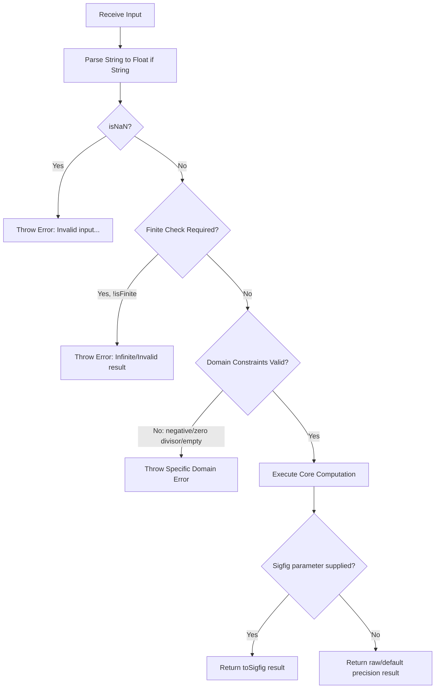

# AGENTS.md

This document serves as the single source of truth for architectural patterns, coding standards, mathematical conventions, documentation guidelines, and testing practices across this repository.

All human contributors and AI agents working on this codebase must adhere strictly to the conventions detailed below.

---

## Table of Contents

1. [Project Overview & Architecture](#1-project-overview--architecture)
   - [Core Design Philosophy](#core-design-philosophy)
2. [Module Directory & Responsibilities](#2-module-directory--responsibilities)
   - [File Tree Structure](#file-tree-structure)
   - [Module Responsibilities Table](#module-responsibilities-table)
3. [Significant Figures & Precision Standards](#3-significant-figures--precision-standards)
   - [Rules of Significant Figures (`sigfigOf`)](#rules-of-significant-figures-sigfigof)
   - [JavaScript Number Limitation & String Inputs](#javascript-number-limitation--string-inputs)
   - [Operational Precision Rules](#operational-precision-rules)
4. [TypeScript & Type System Conventions](#4-typescript--type-system-conventions)
   - [Compiler & Module Settings](#compiler--module-settings)
   - [Typing Rules & Strictness](#typing-rules--strictness)
5. [Function Signatures & Parameter Naming](#5-function-signatures--parameter-naming)
   - [Parameter Type Conventions](#parameter-type-conventions)
   - [Precision Parameter Naming Standards](#precision-parameter-naming-standards)
6. [Input Validation & Error Handling](#6-input-validation--error-handling)
   - [Validation Sequence Pipeline](#validation-sequence-pipeline)
   - [Canonical Error Message Catalog](#canonical-error-message-catalog)
7. [Documentation & JSDoc Standards](#7-documentation--jsdoc-standards)
   - [File-Level Comments](#file-level-comments)
   - [Function JSDoc Template](#function-jsdoc-template)
   - [Class & Method JSDoc Template](#class--method-jsdoc-template)
   - [Interface & Type JSDoc Template](#interface--type-jsdoc-template)
   - [Constants Table JSDoc Template](#constants-table-jsdoc-template)
   - [Mandatory JSDoc Rules](#mandatory-jsdoc-rules)
8. [Testing & Quality Assurance Standards](#8-testing--quality-assurance-standards)
   - [Test Architecture & Suite Structure](#test-architecture--suite-structure)
   - [Mandatory Testing Rules](#mandatory-testing-rules)
9. [Build, Lint & Tooling Workflow](#9-build-lint--tooling-workflow)
   - [Available NPM Scripts](#available-npm-scripts)
   - [Quality Gate Requirements](#quality-gate-requirements)
10. [Agent Contribution Checklist](#10-agent-contribution-checklist)

---

## 1. Project Overview & Architecture

`calc-lib` is an ESM-first TypeScript mathematical calculation library specifically designed to handle **significant figures** according to rigorous scientific standards while providing a comprehensive suite of computational tools for physics, statistics, geometry, computer science, and digital logic.

### Core Design Philosophy

- **Scientific Rigor**: Adhere strictly to accepted scientific rounding rules for significant figures across all arithmetic and mathematical domains.
- **Dual Precision Strategy**:
  - _Core Arithmetic_ (`add`, `sub`, `mul`, `div`) automatically preserves significant figures by default based on operand precision.
  - _Extended Mathematics_ (geometry, statistics, vector algebra) computes in exact double-precision floats (`number`) by default, allowing optional significant figure rounding on demand.
- **Type Safety & Zero Runtime Dependencies**: Pure TypeScript with complete type definitions, strict compiler settings, and zero third-party runtime dependencies.
- **Flexible Numeric Input**: Functions accept both `number` and `string` inputs (e.g. `'2.0'`) so that JavaScript does not strip significant trailing zeros before precision evaluation.

---

## 2. Module Directory & Responsibilities

### File Tree Structure

The codebase is organized into modular files under `src/`, with corresponding unit test suites under `tests/`:

```
calc-lib/
├── src/
│   ├── index.ts              # Central barrel export (named exports + default export)
│   ├── sigfig.ts             # Core significant figure parsing, counting, and rounding
│   ├── operations.ts         # Basic arithmetic (add, sub, mul, div, mod, pow, etc.)
│   ├── constants.ts          # Physical & mathematical constants (PI, E, Planck, etc.)
│   ├── conversion.ts         # Base representations (bin, hex, oct, toBase)
│   ├── formatting.ts         # Scientific, engineering, and percentage formatters
│   ├── geometry.ts           # Trigonometry, 2D/3D shapes, and coordinate distances
│   ├── statistics.ts         # Mean, standard deviation, linear regression, median
│   ├── measurement.ts        # Scientific measurements with uncertainty (value ± error)
│   ├── vector.ts             # N-dimensional vector mathematics and operations
│   ├── computer-science.ts   # Bitwise operations, ASCII/binary conversions, hashing
│   └── logic-gates.ts        # Digital circuits (AND/OR gates, MUX, adders, decoders)
├── tests/                    # Jest/ts-jest unit tests mirroring src/ (12 test suites)
│   ├── index.test.ts
│   ├── sigfig.test.ts
│   ├── operations.test.ts
│   ├── constants.test.ts
│   ├── conversion.test.ts
│   ├── formatting.test.ts
│   ├── geometry.test.ts
│   ├── statistics.test.ts
│   ├── measurement.test.ts
│   ├── vector.test.ts
│   ├── computer-science.test.ts
│   └── logic-gates.test.ts
├── examples/                 # Executable JavaScript usage examples (9 files)
├── eslint.config.js          # ESLint flat configuration (typescript-eslint + jest)
├── tsconfig.json             # TypeScript compiler configuration
├── tsconfig.lint.json        # TypeScript linting configuration (including tests)
└── package.json              # Package metadata and build/test scripts
```

### Module Responsibilities Table

| Module                                                                                            | Primary Responsibility                                       | Key Exports                                                                                    |
| ------------------------------------------------------------------------------------------------- | ------------------------------------------------------------ | ---------------------------------------------------------------------------------------------- |
| [`src/sigfig.ts`](file:///Users/will/Documents/GitHub/calc-lib/src/sigfig.ts)                     | Core precision logic, sigfig counting, and string formatting | `sigfigOf`, `toSigfig`, `getSigfigsForAddOrSub`, `getSigfigsForMulOrDiv`                       |
| [`src/operations.ts`](file:///Users/will/Documents/GitHub/calc-lib/src/operations.ts)             | Arithmetic with automatic sigfig preservation                | `add`, `sub`, `mul`, `div`, `mod`, `idiv`, `pow`, `sqrt`, `abs`, `max`, `min`                  |
| [`src/constants.ts`](file:///Users/will/Documents/GitHub/calc-lib/src/constants.ts)               | High-precision mathematical and physical constants           | `constants`, `getConstant`, `listConstants`                                                    |
| [`src/conversion.ts`](file:///Users/will/Documents/GitHub/calc-lib/src/conversion.ts)             | Python-style radix conversions (bin, hex, oct, base 2-36)    | `bin`, `hex`, `oct`, `toBase`                                                                  |
| [`src/formatting.ts`](file:///Users/will/Documents/GitHub/calc-lib/src/formatting.ts)             | Scientific, engineering, and percentage formatters           | `toScientific`, `toEngineering`, `round`, `percentage`, `truncate`                             |
| [`src/geometry.ts`](file:///Users/will/Documents/GitHub/calc-lib/src/geometry.ts)                 | Angles, 2D/3D shapes, and coordinate distances               | `toRadians`, `toDegrees`, `circleArea`, `sphereVolume`, `distance2D`, `distance3D`             |
| [`src/statistics.ts`](file:///Users/will/Documents/GitHub/calc-lib/src/statistics.ts)             | Statistical analysis, descriptive stats, and regression      | `mean`, `standardDeviation`, `median`, `descriptiveStats`, `linearRegression`, `predictLinear` |
| [`src/measurement.ts`](file:///Users/will/Documents/GitHub/calc-lib/src/measurement.ts)           | Experimental uncertainty modeling (value ± error)            | `uncertainty`, `createMeasurement`, `Measurement`                                              |
| [`src/vector.ts`](file:///Users/will/Documents/GitHub/calc-lib/src/vector.ts)                     | N-dimensional vector mathematics and linear algebra          | `Vector` class                                                                                 |
| [`src/computer-science.ts`](file:///Users/will/Documents/GitHub/calc-lib/src/computer-science.ts) | CS utilities, bit manipulation, hashing, and Base64          | `toAscii`, `toBinary`, `toHex`, `bitwiseAnd`, `popCount`, `isPowerOfTwo`, `toBase64`           |
| [`src/logic-gates.ts`](file:///Users/will/Documents/GitHub/calc-lib/src/logic-gates.ts)           | Logic gates and digital circuit simulation                   | `and`, `or`, `xor`, `halfAdder`, `fullAdder`, `mux`, `demux`, `decoder`, `encoder`             |
| [`src/index.ts`](file:///Users/will/Documents/GitHub/calc-lib/src/index.ts)                       | Central library entry point                                  | Named exports for all modules and default `CalcLib` bundle object                              |

---

## 3. Significant Figures & Precision Standards

### Rules of Significant Figures (`sigfigOf`)

1. **Non-zero digits** are always significant (e.g. `123` $\rightarrow$ 3 sigfigs).
2. **Zeros between non-zero digits** are significant (e.g. `1002` $\rightarrow$ 4 sigfigs).
3. **Leading zeros** are _never_ significant (e.g. `0.0025` $\rightarrow$ 2 sigfigs).
4. **Trailing zeros after a decimal point** are significant (e.g. `'2.00'` $\rightarrow$ 3 sigfigs).
5. **Trailing zeros in whole numbers without a decimal point** are ambiguous and treated as non-significant (e.g. `100` $\rightarrow$ 1 sigfig, whereas `'100.'` $\rightarrow$ 3 sigfigs).
6. **Scientific notation**: all digits in the coefficient are significant (e.g. `'1.20e3'` $\rightarrow$ 3 sigfigs).

### JavaScript Number Limitation & String Inputs

> [!IMPORTANT]
> In standard JavaScript runtimes, numeric literals like `2.0` evaluate directly to `2` (trailing zeros are discarded by the engine before function execution). To preserve trailing zeros for exact significant figure evaluation, callers should pass string inputs: `mul('2.0', 3.14159)`.

### Operational Precision Rules

#### 1. Core Addition & Subtraction (`add`, `sub`)

- **Rule**: Result preserves the decimal places of the _least precise operand_.
- **Implementation**: Uses `getSigfigsForAddOrSub([a, b])`.
- **Example**: `add(1.234, 2.56)` $\rightarrow$ `3.79` (limited by 2 decimal places in `2.56`).

#### 2. Core Multiplication & Division (`mul`, `div`)

- **Rule**: Result preserves the _minimum significant figures_ of all operands.
- **Implementation**: Uses `getSigfigsForMulOrDiv([a, b])`.
- **Example**: `mul(2.34, 5.6)` $\rightarrow$ `13` (limited by 2 sigfigs in `5.6`).

#### 3. Extended Math & Scientific Modules

- **Rule**: Return full unrounded IEEE 754 `number` floats by default.
- **Override**: When the optional `sigfigs` (or `toSigfigParam`) parameter is passed, the result is rounded using `toSigfig(result, sigfigs)`.
- **Example**:
  - `circleArea(5)` $\rightarrow$ `78.53981633974483` (exact float)
  - `circleArea(5, 3)` $\rightarrow$ `78.5` (rounded to 3 sigfigs)

#### 4. Linear Regression Precision (`linearRegression`, `predictLinear`)

- When `sigfigs` is not explicitly provided to `linearRegression`, it defaults to preserving the minimum significant figures across all input coordinates.
- `predictLinear` computes exact unrounded predictions by default, or rounds to `sigfigs` when supplied.

#### 5. Uncertainty Modeling Precision (`uncertainty`, `createMeasurement`)

- `uncertainty(value, error)` automatically derives the required decimal places from the magnitude of the uncertainty parameter when `sigfigs` is omitted.

#### 6. Formatting Output Range

- When `toSigfig(value, sigfigs)` formats values, numbers with magnitude $\ge 10^6$ or $< 10^{-2}$ automatically format using scientific notation (`e` format), while values within $[10^{-2}, 10^6)$ format as fixed decimal notation with trailing zeros trimmed for whole values.

---

## 4. TypeScript & Type System Conventions

### Compiler & Module Settings

- **Target**: `ES2020`
- **Module Resolution**: `node16` / `bundler`
- **Module System**: Pure ESM (`"type": "module"` in `package.json`).
- **Internal Imports**: All relative module imports within `src/` **must** include the explicit `.js` extension:
  ```typescript
  // CORRECT
  import { toSigfig } from './sigfig.js';
  import { constants } from './constants.js';

  // INCORRECT
  import { toSigfig } from './sigfig';
  ```

### Typing Rules & Strictness

1. **Explicit Return Types**: All exported functions, methods, and getters must specify an explicit return type:
   ```typescript
   // CORRECT
   export function toRadians(degrees: number | string, sigfigs?: number): number { ... }

   // INCORRECT
   export function toRadians(degrees: number | string, sigfigs?: number) { ... }
   ```
2. **Ban on `any` in Source**: The use of `any` is strictly prohibited in `src/`. Use `unknown`, proper generic constraints, or descriptive union types:
   ```typescript
   export type NumberInput = number | string;
   export type LogicInput = number | string | boolean;
   ```
3. **Type-Only Imports & Exports**: Always use `import type` or `export type` when importing/exporting types to ensure clean runtime bundles:
   ```typescript
   export type { Measurement } from './measurement.js';
   export type { LogicValue, LogicInput } from './logic-gates.js';
   export type { LinearRegressionResult } from './statistics.js';
   ```
4. **Immutability**:
   - Class properties that are not modified after construction must be marked `private readonly`.
   - Constant lookup tables must be asserted with `as const` (e.g. `export const constants = { ... } as const;`).
5. **Modern Operators**:
   - Prefer nullish coalescing (`??`) over logical OR (`||`) for handling default numeric/boolean arguments.
   - Prefer optional chaining (`?.`) over manual truthiness guards.

---

## 5. Function Signatures & Parameter Naming

### Parameter Type Conventions

1. **Scalar Numeric Inputs**: Accept `number | string` to support precision-preserving string representations.
2. **Numeric Array Inputs**: Accept `(number | string)[]`.
3. **Logic Inputs**: Accept `LogicInput[]` where `LogicInput = number | string | boolean`.

### Precision Parameter Naming Standards

- **`src/operations.ts`**: The optional precision override parameter is named `toSigfigParam?: number` (to prevent name shadowing with the imported `toSigfig` helper function):
  ```typescript
  export function add(a: number | string, b: number | string, toSigfigParam?: number): number;
  export function pow(
    base: number | string,
    exponent: number | string,
    toSigfigParam?: number,
  ): number;
  ```
- **All Other Modules**: The optional precision parameter is named `sigfigs?: number`:
  ```typescript
  export function toRadians(degrees: number | string, sigfigs?: number): number;
  export function mean(values: (number | string)[], sigfigs?: number): number;
  export function toScientific(value: number | string, sigfigs?: number): string;
  ```

---

## 6. Input Validation & Error Handling

All public functions must validate inputs defensibly before performing calculations.

### Validation Sequence Pipeline



### Canonical Error Message Catalog

Error messages must be descriptive, clear, and follow consistent phrasing:

- **Invalid Numeric Input**:
  - `throw new Error('Invalid input: value must be a valid number');`
  - `throw new Error('Invalid input: both operands must be valid numbers');`
  - `throw new Error('Invalid input: all coordinates must be valid numbers');`
  - `throw new Error('All values must be valid numbers');`
- **Empty Array Input**:
  - `throw new Error('Input must be a non-empty array of numbers');`
  - `throw new Error('Vector must have at least one component');`
- **Zero Division**:
  - `throw new Error('Division by zero is not allowed');`
  - `throw new Error('Division by zero: modulo by zero is undefined');`
  - `throw new Error('Division by zero: whole value cannot be zero');`
  - `throw new Error('Cannot normalize zero vector');`
  - `throw new Error('Cannot project onto zero vector');`
- **Domain & Geometric Constraints**:
  - `throw new Error('Cannot take square root of negative number');`
  - `throw new Error('Radius must be non-negative');`
  - `throw new Error('Uncertainty must be non-negative');`
  - `throw new Error('Shift positions must be non-negative');`
  - `throw new Error('Number of significant figures must be positive');`
  - `throw new Error('Cross product is only defined for 3D vectors');`

---

## 7. Documentation & JSDoc Standards

Every source file, exported function, class, interface, and type must have complete, clean JSDoc documentation.

### File-Level Comments

Every `.ts` file must begin with a concise multi-line comment header:

```typescript
/**
 * Precise mathematical operations with significant figure preservation
 */
```

### Function JSDoc Template

````typescript
/**
 * Calculates the area of a circle
 *
 * @param radius - Radius of the circle
 * @param sigfigs - Optional: number of significant figures (default: exact unrounded value)
 * @returns Area of the circle (πr²)
 *
 * @example
 * ```typescript
 * circleArea(5)      // 78.53981633974483 (25π)
 * circleArea(5, 4)   // 78.54 (custom: 4 significant figures)
 * circleArea(2.5, 3) // 19.6 (custom: 3 significant figures)
 * ```
 */
````

### Class & Method JSDoc Template

````typescript
/**
 * Vector class for mathematical vector operations
 */
export class Vector {
  /**
   * Calculate the magnitude (Euclidean norm / length) of the vector
   *
   * @returns Magnitude of the vector
   *
   * @example
   * ```typescript
   * const v = new Vector([3, 4]);
   * v.magnitude(); // 5
   * ```
   */
  magnitude(): number { ... }
}
````

### Interface & Type JSDoc Template

```typescript
/**
 * Linear regression result interface
 */
export interface LinearRegressionResult {
  /** Slope (m) of the line y = mx + b */
  slope: number;
  /** Y-intercept (b) of the line y = mx + b */
  intercept: number;
  /** Correlation coefficient (r) - measure of linear relationship strength */
  correlation: number;
  /** Coefficient of determination (r²) - proportion of variance explained */
  rSquared: number;
}
```

### Constants Table JSDoc Template

```typescript
/**
 * Mathematical constants object containing commonly used values
 */
export const constants = {
  /** Pi (π) - ratio of circumference to diameter of a circle */
  PI: 3.141592653589793,
  ...
} as const;
```

### Mandatory JSDoc Rules

1. **Hyphen Separator**: Always use `@param name - Description` with a spaced hyphen.
2. **Document Defaults**: When a parameter is optional, specify the default behavior in parentheses: `(default: exact unrounded value)`.
3. **Executable Examples**: Provide `@example` blocks formatted with ````typescript code fences containing realistic, verified outputs.

---

## 8. Testing & Quality Assurance Standards

### Test Architecture & Suite Structure

- Test files reside in `tests/` and mirror `src/`: `tests/<module>.test.ts` tests `src/<module>.ts`.
- Test runner: **Jest** with `ts-jest`.
- All 12 test suites are executed with `npm test` or `npm run test:coverage`.

```typescript
describe('circleArea', () => {
  test('calculates circle area correctly', () => {
    expect(circleArea(1)).toBeCloseTo(Math.PI, 10);
    expect(circleArea(2)).toBeCloseTo(4 * Math.PI, 10);
  });

  test('handles decimal radius', () => {
    expect(circleArea(2.5)).toBeCloseTo(6.25 * Math.PI, 10);
  });

  test('handles string inputs', () => {
    expect(circleArea('2')).toBeCloseTo(4 * Math.PI, 10);
  });

  test('respects custom significant figures', () => {
    expect(circleArea(5, 3)).toBeCloseTo(78.5, 1);
  });

  test('throws error for negative radius', () => {
    expect(() => circleArea(-1)).toThrow('Radius must be non-negative');
  });

  test('throws error for invalid input', () => {
    expect(() => circleArea('invalid')).toThrow('Invalid input: radius must be a valid number');
  });
});
```

### Mandatory Testing Rules

1. **Floating Point Equality**: Never use `.toBe()` or `.toEqual()` to compare floating point calculation results. Always use `expect(...).toBeCloseTo(expected, numDigits)` to avoid IEEE 754 precision mismatches.
2. **Active Voice Test Titles**: Write clear test titles starting with active verbs:
   - `test('calculates ...')`
   - `test('handles string inputs')`
   - `test('handles negative values')`
   - `test('respects custom significant figures')`
   - `test('throws error for ...')`
   - `test('performs ...')`
3. **No Duplicate Test Titles**: Never repeat test titles within the same `describe` block (enforced by ESLint `jest/no-identical-title`).
4. **Coverage Standard**: Maintain 100% statement, branch, and line coverage across all modules. All logical branches and error throws must have test coverage.
5. **Bug-First Verification Rule**: When fixing any reported bug, **always write a failing test first**, verify the failure, implement the fix, and keep the test as a permanent regression guard.

---

## 9. Build, Lint & Tooling Workflow

### Available NPM Scripts

| Script                  | Command                                                               | Purpose                                                                           |
| ----------------------- | --------------------------------------------------------------------- | --------------------------------------------------------------------------------- |
| `npm run build`         | `tsc`                                                                 | Compiles TypeScript source from `src/` to `dist/` with `.d.ts` declaration maps   |
| `npm test`              | `jest`                                                                | Runs the full test suite across all 12 test files                                 |
| `npm run test:coverage` | `jest --coverage`                                                     | Runs all tests and generates statement/branch/line coverage metrics               |
| `npm run lint`          | `eslint .`                                                            | Runs ESLint flat config on all TypeScript, JavaScript, and test files             |
| `npm run typecheck`     | `tsc --noEmit -p tsconfig.json && tsc --noEmit -p tsconfig.lint.json` | Validates TypeScript types across both `src/` and `tests/` without emitting files |
| `npm run dev`           | `tsc --watch`                                                         | Runs the TypeScript compiler in watch mode for development                        |

### Quality Gate Requirements

Before committing or concluding any task, ensure:

1. `npm run lint` exits with **0 errors and 0 warnings**.
2. `npm run typecheck` exits with **0 type errors**.
3. `npm run test:coverage` passes **100% of test suites and tests** with 100% statement, branch, and line coverage.
4. `npm run build` completes cleanly without errors.

---

## 10. Agent Contribution Checklist

When implementing new features, fixing bugs, or refactoring in `calc-lib`, follow this checklist:

- [ ] **Input Flexibility**: Does the new function accept `number | string`?
- [ ] **Validation**: Are `NaN`, `!isFinite`, negative values, or zero-division edge cases handled and guarded with descriptive error messages?
- [ ] **Precision Convention**: Does the function follow the established precision standard (Core arithmetic = auto-preservation; Extended math = raw float by default with optional `sigfigs` override)?
- [ ] **TypeScript Types**: Are all exported functions explicitly typed? Are imports using `.js` extensions?
- [ ] **JSDoc**: Does every exported entity have a complete JSDoc header with `@param`, `@returns`, and `@example`?
- [ ] **Unit Tests**: Have unit tests been added covering standard behavior, boundary edge cases, string inputs, custom sigfigs, and invalid/error inputs?
- [ ] **Regression Guard**: Was any fixed bug verified with a failing test before the fix?
- [ ] **Quality Checks**: Do `npm run lint`, `npm run typecheck`, `npm test`, and `npm run build` all pass cleanly?
